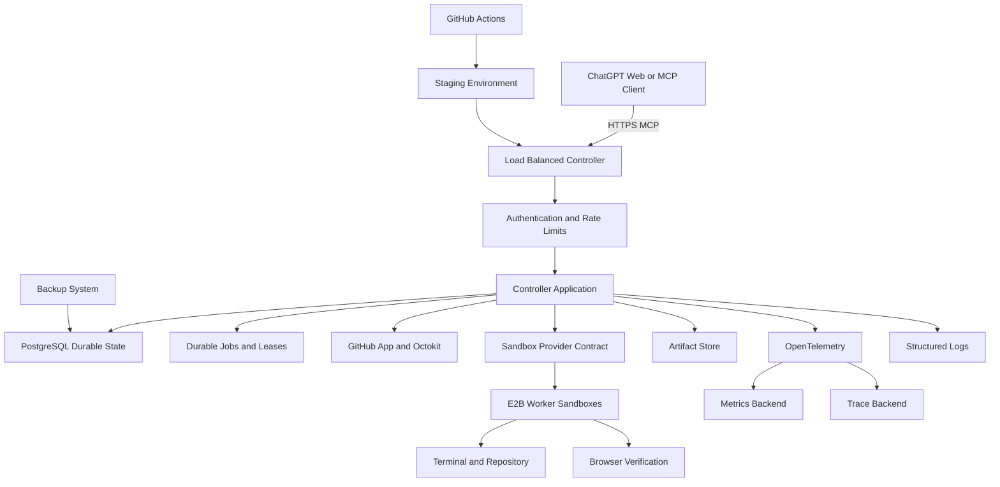
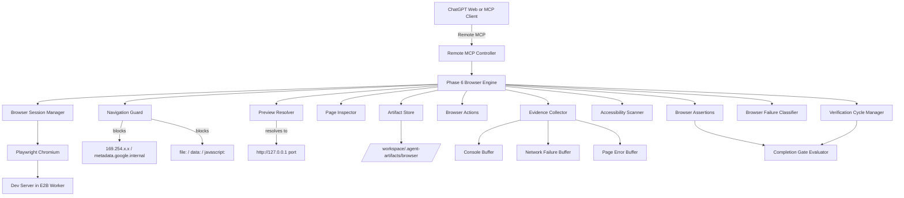
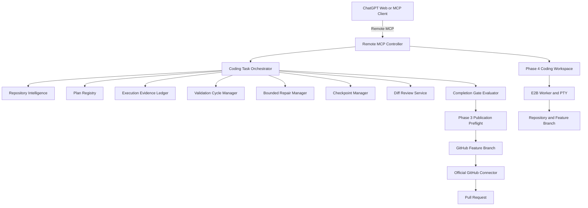
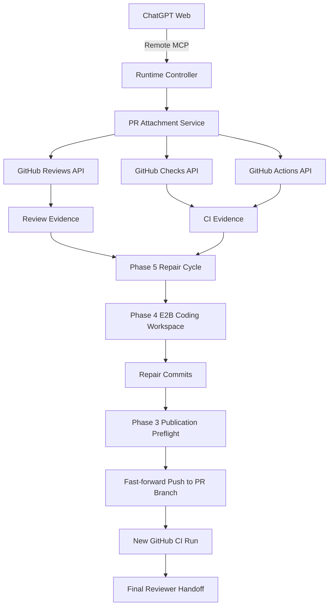

# Architecture Map: E2B Agent Runtime

An architecture and runtime for running a **Remote Model Context Protocol (MCP) Controller** in an isolated cloud computer using E2B Sandboxes, orchestrating disposable E2B Worker Sandboxes for safe tool execution, PTY terminal sessions, repository intelligence, task planning, evidence tracking, bounded repair cycles, checkpoints, diff review, GitHub branch publication, and **browser + UI verification via Playwright Chromium**.

---

## Phase 9 Durable Production Hardening Architecture



---

## Phase 7 Sandbox Provider Architecture

```mermaid
flowchart TD
    A[ChatGPT Web] -->|Remote MCP| B[Runtime MCP Controller]
    B --> C[Sandbox Provider Contract]
    C --> D[Direct E2B Provider]
    C --> E[OpenAI Agents E2B Provider (Guarded)]
    D --> F[E2B Sandbox]
    E --> F
    F --> G[Terminal and Filesystem]
    F --> H[Repository Workspace]
    F --> I[Browser and Artifacts]

    J[Optional OpenAI Agents SDK Client] -->|Streamable HTTP MCP| B
    J --> K[Optional SandboxAgent Example]
    K --> E

    B --> L[Workflow and Evidence Layer]
    L --> M[GitHub Publication Broker]
```

## Phase 6 Browser & User-Interface Verification Architecture



### Phase 6 Component Responsibilities

| Component | File | Responsibility |
|---|---|---|
| **Browser Session Manager** | `src/browser/browser-session-manager.ts` | Playwright Chromium launch, isolated contexts, page lifecycle, session limits, mutex locking. |
| **Navigation Guard** | `src/browser/navigation-guard.ts` | Scheme allowlist, credential blocking, metadata IP blocking, URL normalization, query token redaction. |
| **URL Sanitizer** | `src/browser/url-sanitizer.ts` | Shared utility: redacts sensitive query parameter values (token, key, secret, etc.) from URLs. Used by NavigationGuard and EvidenceCollector. |
| **Preview Resolver** | `src/browser/preview-resolver.ts` | Resolves `http://127.0.0.1:<port>` internal URLs; never leaks E2B traffic tokens. |
| **Page Inspector** | `src/browser/page-inspector.ts` | Bounded structural/accessibility snapshots; opaque element refs; locator resolution (role, label, testId, css — XPath banned). |
| **Browser Actions** | `src/browser/browser-actions.ts` | Click, fill (password redacted), press, select_option, check, upload_file (workspace path checks), wait_for. |
| **Browser Assertions** | `src/browser/browser-assertions.ts` | Evaluates 14+ assertion types (url-equals, text-visible, element-count, element-hidden, title-contains, etc.) against real page state. |
| **Evidence Collector** | `src/browser/evidence-collector.ts` | Console, page error, and network failure listeners with ring-buffer capping and secret redaction. |
| **Accessibility Scanner** | `src/browser/accessibility-scanner.ts` | axe-core scans via `@axe-core/playwright` with bounded result count and structural fallback. |
| **Artifact Store** | `src/browser/artifact-store.ts` | Screenshot & trace storage, SHA-256 integrity, short-lived pre-signed download URLs, retention enforcement. |
| **Browser Failure Classifier** | `src/browser/browser-failure-classifier.ts` | Declarative rules-table classifier for 11 browser failure categories (DNS, TLS, timeout, locator-ambiguous, locator-not-found, assertion, hydration, JavaScript, accessibility, browser-crash, unknown). |
| **Verification Cycle Manager** | `src/browser/verification-cycle-manager.ts` | Browser verification cycles bound to task head SHA; detects stale evidence when head moves mid-cycle. |

---

## Phase 5 AI-Assisted Coding Workflow Engine Architecture



---

## Phase 8: Pull Request Repair & CI Inspection Architecture



---

## Component Index

### Phase 7: Framework Consolidation (`src/sandbox/`)

- **Sandbox Provider Contract**: Neutral boundary interface representing sandbox session management (`createSession`, `connectSession`, `execCommand`, `PTY management`, `filesystem operations`, etc.).
- **Available Providers**:
  - `direct-e2b`: Wrapped core SDK implementation. Selected as the production default.
  - `openai-agents-e2b`: Gated adapter using E2BSandboxClient, requiring Node.js 22+.
- **Compatibility Audits**: Automated checks for exact framework package versions and peer compatibility mapping.

### Phase 6: Browser & UI Verification (`src/browser/`, `src/mcp/tools/phase6-tools.ts`)

- **26 Remote MCP Tools**: registered on the Controller MCP server. Includes session lifecycle, navigation, page inspection, actions, assertions, evidence retrieval, failure classification, trace recording, artifact management, and verification cycles.
- **4 Runtime Policies**: `browser-policy.json`, `navigation-policy.json`, `artifact-policy.json`, `accessibility-policy.json` — validated at startup via `pnpm browser:validate-policies`.
- **Template Version**: `agent-coding-runtime-core:v0.2.0` — updated in `runtime-pack/MANIFEST.json` with Playwright `1.61.1` and Chromium `149.0.7827.55`.

### Phase 8: Pull Request Repair & CI Inspection (`src/workflow/pr-repair-store.ts`, `src/mcp/tools/phase8-tools.ts`)

- **Pull Request Repair State store**: Persistent schema-validated store for PR repair sessions in `.data/pr-repairs/` with atomic locking and transactions.
- **20 New MCP Tools**: Attachment, review threads collection, GraphQL and REST querying, feedback classification, check statuses, Actions logs, log sanitation, workspace reconstruction, cycle management, diff review, preflight, fast-forward pushed repairs, CI polling, and response formatting.

### 1. Remote MCP Controller & Task Orchestration (`src/controller/`, `src/mcp/`, `src/workflow/`)
- **Server**: Express HTTP + Streamable HTTP MCP server on port 3000.
- **Authentication**: Bearer token (`MCP_ACCESS_TOKEN`).
- **Coding Task Store**: `src/workflow/task-store.ts`. Persistent atomic JSON task state with schema versioning and per-task mutex locking.
- **Phase 5 MCP Tools**: 26 MCP tools registered on Controller server (`coding_task_start`, `repository_intelligence_scan`, `coding_plan_set`, `execution_record_command`, `validation_cycle_start`, `repair_attempt_start`, `coding_checkpoint_create`, `coding_diff_review`, `coding_completion_gate`, etc.).

### 2. Repository Intelligence & Search (`src/workflow/repository-intelligence.ts`, `src/workflow/repository-search.ts`)
- **Repository Intelligence**: Stack detection, manifest analysis (`package.json`, `tsconfig.json`, `Cargo.toml`), governance discovery, command detection, and sectioned intelligence reports.
- **Repository Search & Symbol Search**: Safe ripgrep search, file finding, and symbol search with confidence ratings (`high`, `medium`, `low`). Prevents path traversal outside `/workspace/repository`.

### 3. Task Planning & Evidence Ledger (`src/workflow/plan-registry.ts`, `src/workflow/evidence-ledger.ts`)
- **Plan Registry**: Validates max plan steps (20), step ID uniqueness, dependency cycle detection, verification step requirements, and step updates.
- **Evidence Ledger**: Correlates Phase 4 terminal execution records as evidence, tracks start/end head SHA and dirty state, and marks evidence stale when code changes.

### 4. Bounded Repair Cycles & Failure Classifier (`src/workflow/validation-repair-manager.ts`, `src/workflow/failure-classifier.ts`)
- **Failure Classifier**: Categorizes test/command failures (`type-check`, `unit-test`, `lint`, `dependency`, `compilation`, `timeout`, etc.) and computes repeated failure signatures.
- **Validation & Repair Manager**: Manages validation cycles, bounded repair budgets (`MAX_REPAIR_CYCLES=3`, `MAX_TOTAL_COMMANDS_PER_TASK=100`), hypothesis verification, and repeat action detection.

### 5. Checkpoints, Drift & Completion Gates (`src/workflow/checkpoint-manager.ts`, `src/workflow/diff-review.ts`, `src/workflow/completion-gate.ts`)
- **Checkpoint Manager**: Compact, sanitized checkpoints using `SESSION_CHECKPOINT.md` format with content hashing. Resumes tasks with drift detection (`no-drift`, `local-head-moved`, `worktree-changed`, `branch-changed`, `worker-recreated`).
- **Diff Review & Completion Gate**: Evaluates working tree diff against base SHA, flags secret findings, unplanned files, and debug artifacts. For web tasks, also checks browser verification gate. Blocks publication if required checks fail, worktree is dirty, or no commits exist.

### 6. Persistent PTY & Terminal Sessions (`src/terminal/`)
- **Terminal Session Manager**: `terminal_open`, `terminal_exec`, `terminal_write`, `terminal_read`, `terminal_resize`, `terminal_send_signal`, `terminal_close`, `terminal_list`.
- **PTY Buffer**: Monotonic global byte cursor ring buffer (`PTY_BUFFER_MAX_BYTES=1048576`), gap detection, UTF-8 chunking, and output truncation.

### 7. GitHub App Integration (`src/github/`)
- **Token Broker**: Generates short-lived, repository-scoped installation tokens.
- **Secret Gate & Preflight**: Scans committed diffs for secrets before branch publication.

---

## Trust & Security Boundaries

| Scope | Exposed Credentials | Allowed Operations |
|---|---|---|
| **Controller Sandbox** | `E2B_API_KEY`, `MCP_ACCESS_TOKEN`, `GITHUB_APP_PRIVATE_KEY` | Auth broker, task store, evidence ledger, repair manager, checkpoint persistence, worker lifecycle, browser session management |
| **Worker Sandbox** | Short-lived installation token passed inline per command | Local checkout, PTY interactive sessions, one-shot commands, dev servers, test execution, branch publication, Playwright Chromium execution |
| **MCP Client (ChatGPT)** | Bearer Token (`MCP_ACCESS_TOKEN`) | Direct control via Remote MCP tools. ChatGPT is the reasoning layer. No inner AI coding model is installed. |
| **Browser Artifacts** | None exposed | Stored in `/workspace/.agent-artifacts/browser/` (outside git tree). Accessible only via short-lived pre-signed download URLs. |

---

## Phase 9: Hardening & Production Readiness Component Index

- **Durable Persistence**: `src/persistence/postgres/client.ts` connection pooling, queries, transactions, and migration runner.
- **Distributed Leases**: `src/persistence/postgres/leases.ts` table-backed atomic lock acquisition and stale lease recovery.
- **Idempotency Store**: `src/persistence/postgres/idempotency.ts` prevents duplicate writes or creations.
- **Quota & Rate Limits**: `src/persistence/postgres/quotaManager.ts` active session counting and resource constraints; `src/persistence/postgres/rateLimiter.ts` sliding window rate limiter.
- **Graceful Shutdown**: `src/controller/server.ts` connection draining, telemetry flushes, and background timers termination.
- **Status MCP Tools**: `src/mcp/tools/phase9-tools.ts` provides `runtime_system_status`, `runtime_capacity_status`, and `runtime_incident_snapshot` tools.
