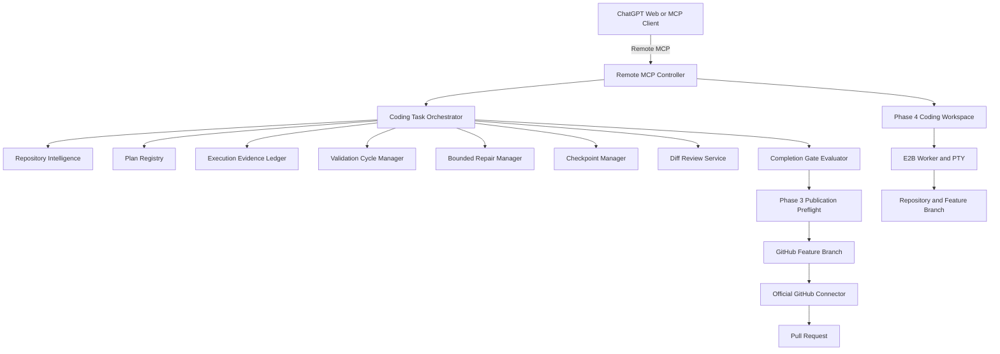

# Architecture Map: E2B Agent Runtime

An architecture and runtime for running a **Remote Model Context Protocol (MCP) Controller** in an isolated cloud computer using E2B Sandboxes, orchestrating disposable E2B Worker Sandboxes for safe tool execution, PTY terminal sessions, repository intelligence, task planning, evidence tracking, bounded repair cycles, checkpoints, diff review, and GitHub branch publication.

---

## Phase 5 AI-Assisted Coding Workflow Engine Architecture

---

## Component Index

### 1. Remote MCP Controller & Task Orchestration (`src/controller/`, `src/mcp/`, `src/workflow/`)
- **Server**: Express HTTP + Streamable HTTP MCP server on port 3000.
- **Authentication**: Bearer token (`MCP_ACCESS_TOKEN`).
- **Coding Task Store**: `src/workflow/task-store.ts`. Persistent atomic JSON task state with schema versioning and per-task mutex locking.
- **Phase 5 MCP Tools**: 26 MCP tools registered on Controller server (`coding_task_start`, `repository_intelligence_scan`, `coding_plan_set`, `execution_record_command`, `validation_cycle_start`, `repair_attempt_start`, `coding_checkpoint_create`, `coding_diff_review`, `coding_completion_gate`, etc.).

### 2. Repository Intelligence & Search (`src/workflow/repository-intelligence.ts`, `src/workflow/repository-search.ts`)
- **Repository Intelligence**: Stack detection, manifest analysis (`package.json`, `tsconfig.json`, `Cargo.toml`), governance discovery, command detection, and sectioned intelligence reports.
- **Repository Search & Symbol Search**: Safe ripgrep search, file finding, and symbol search with confidence ratings (`high`, `medium`, `low`). Prevents path traversal outside `/workspace/repository`.

### 3. Task Planning & Evidence Ledger (`src/workflow/plan-registry.ts`, `src/workflow/evidence-ledger.ts`)
- **Plan Registry**: Validates max plan steps (20), step ID uniqueness, dependency cycle detection, verification step requirements, and step updates.
- **Evidence Ledger**: Correlates Phase 4 terminal execution records as evidence, tracks start/end head SHA and dirty state, and marks evidence stale when code changes.

### 4. Bounded Repair Cycles & Failure Classifier (`src/workflow/validation-repair-manager.ts`, `src/workflow/failure-classifier.ts`)
- **Failure Classifier**: Categorizes test/command failures (`type-check`, `unit-test`, `lint`, `dependency`, `compilation`, `timeout`, etc.) and computes repeated failure signatures.
- **Validation & Repair Manager**: Manages validation cycles, bounded repair budgets (`MAX_REPAIR_CYCLES=3`, `MAX_TOTAL_COMMANDS_PER_TASK=100`), hypothesis verification, and repeat action detection.

### 5. Checkpoints, Drift & Completion Gates (`src/workflow/checkpoint-manager.ts`, `src/workflow/diff-review.ts`, `src/workflow/completion-gate.ts`)
- **Checkpoint Manager**: Compact, sanitized checkpoints using `SESSION_CHECKPOINT.md` format with content hashing. Resumes tasks with drift detection (`no-drift`, `local-head-moved`, `worktree-changed`, `branch-changed`, `worker-recreated`).
- **Diff Review & Completion Gate**: Evaluates working tree diff against base SHA, flags secret findings, unplanned files, and debug artifacts. Blocks publication if required checks fail, worktree is dirty, or no commits exist. Generates structured PR handoff markdown using `PR_TEMPLATE.md`.

### 6. Persistent PTY & Terminal Sessions (`src/terminal/`)
- **Terminal Session Manager**: `terminal_open`, `terminal_exec`, `terminal_write`, `terminal_read`, `terminal_resize`, `terminal_send_signal`, `terminal_close`, `terminal_list`.
- **PTY Buffer**: Monotonic global byte cursor ring buffer (`PTY_BUFFER_MAX_BYTES=1048576`), gap detection, UTF-8 chunking, and output truncation.

### 7. GitHub App Integration (`src/github/`)
- **Token Broker**: Generates short-lived, repository-scoped installation tokens.
- **Secret Gate & Preflight**: Scans committed diffs for secrets before branch publication.

---

## Trust & Security Boundaries

| Scope | Exposed Credentials | Allowed Operations |
|---|---|---|
| **Controller Sandbox** | `E2B_API_KEY`, `MCP_ACCESS_TOKEN`, `GITHUB_APP_PRIVATE_KEY` | Auth broker, task store, evidence ledger, repair manager, checkpoint persistence, worker lifecycle |
| **Worker Sandbox** | Short-lived installation token passed inline per command | Local checkout, PTY interactive sessions, one-shot commands, dev servers, test execution, branch publication |
| **MCP Client (ChatGPT)** | Bearer Token (`MCP_ACCESS_TOKEN`) | Direct control via Remote MCP tools. ChatGPT is the reasoning layer. No inner AI coding model is installed. |
