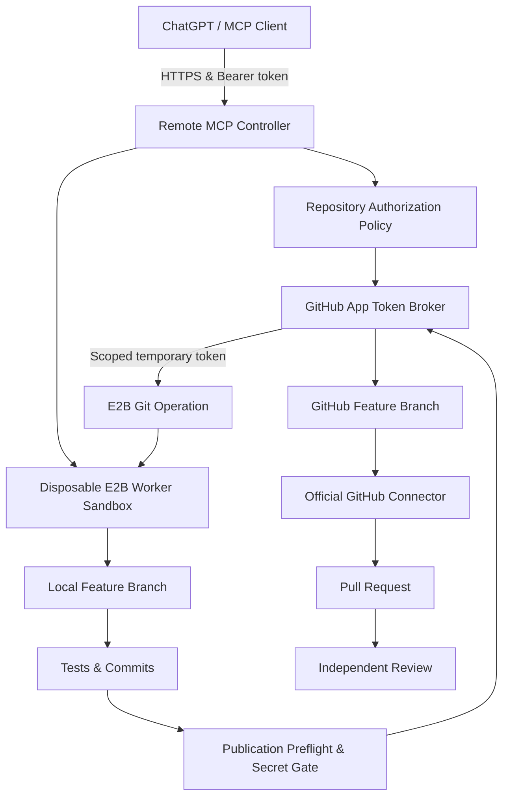

# Architecture Map: E2B Agent Runtime

An architecture and runtime for running a **Remote Model Context Protocol (MCP) Controller** in an isolated cloud computer using E2B Sandboxes, orchestrating disposable E2B Worker Sandboxes for safe tool execution and GitHub branch publication.

---

## Phase 3 Architecture & Flow

---

## Component Index

### 1. Remote MCP Controller (`src/controller/`, `src/mcp/`)
- **Server**: Express HTTP + Streamable HTTP MCP server on port 3000.
- **Authentication**: Bearer token (`MCP_ACCESS_TOKEN`).
- **Tools**: Exposes session lifecycle tools and 14 repository workspace tools (`repository_bind`, `repository_clone`, `repository_inspect`, `repository_read_file`, `repository_write_file`, `repository_apply_patch`, `git_create_branch`, `git_status`, `git_diff`, `git_commit`, `validation_record`, `github_preflight_publish`, `github_publish_branch`, `github_prepare_pr_handoff`).

### 2. GitHub App Integration (`src/github/`)
- **Config**: Parses `GITHUB_APP_ID`, `GITHUB_APP_INSTALLATION_ID`, `GITHUB_APP_PRIVATE_KEY` / `GITHUB_APP_PRIVATE_KEY_BASE64`, allowlists, and default branch prefix.
- **Token Broker** (`token-broker.ts`): Uses `@octokit/auth-app` to generate short-lived, repository-scoped installation tokens. Caches tokens in memory with refresh skew. Registers secrets with `logger.registerSecret` for automatic redaction.
- **Authorization Policy** (`authorization.ts`): Enforces owner/repo validation and explicit allowlists. Rejects malformed strings, URLs, query params, SSH injections, and local paths.
- **Client Wrapper** (`client.ts`): Interacts with GitHub REST API via Octokit to query repository metadata, default branch, and branch SHAs.
- **Secret Gate** (`secret-gate.ts`): Scans committed diffs and changed files for private keys, AWS/GitHub tokens, and credential patterns before publication.
- **Preflight Validator** (`preflight.ts`): Verifies workspace clean status, commit history beyond base, forbidden paths (`.env`, `.git/`), base branch drift (`baseMoved`), and executed validation records.

### 3. Worker Workspace & Git Operations (`src/e2b/`, `src/security/`)
- **File Safety** (`file-safety.ts`): Enforces that all file operations remain strictly inside `/workspace/repository`. Rejects path traversal (`..`), null bytes, `.git/` directory access, and secret files (`.env`).
- **Worker Git Operations** (`git-operations.ts`): Executes `git clone`, `git branch`, `git status`, `git diff`, `git commit`, and `git push` inside the E2B Worker Sandbox. Uses inline `http.extraheader="AUTHORIZATION: basic <base64>"` to pass installation tokens without saving credentials to `.git/config` or process environment.

### 4. Runtime Registry & Locks (`src/runtime/`)
- **Session Registry** (`session-registry.ts`): Persists session state, `repositoryState`, and `validationRecords` to JSON registry (`.data/sessions.json`) using atomic file writes.
- **Async Lock Manager** (`repository-lock.ts`): Prevents concurrent race conditions on per-session repository operations.
- **Concurrency Gate** (`concurrency-gate.ts`): Limits maximum concurrent worker sandboxes (`MAX_ACTIVE_WORKERS`).

---

## Trust & Security Boundaries

| Scope | Exposed Credentials | Allowed Operations |
|---|---|---|
| **Controller Sandbox** | `E2B_API_KEY`, `MCP_ACCESS_TOKEN`, `GITHUB_APP_PRIVATE_KEY` | Auth broker, token minting, policy authorization, worker lifecycle |
| **Worker Sandbox** | Short-lived installation token passed inline per command | Local checkout, code modifications, test execution, branch publication |
| **MCP Client (ChatGPT)** | Bearer Token (`MCP_ACCESS_TOKEN`) | High-level tool invocation via MCP. Never receives private key or Git tokens. |
