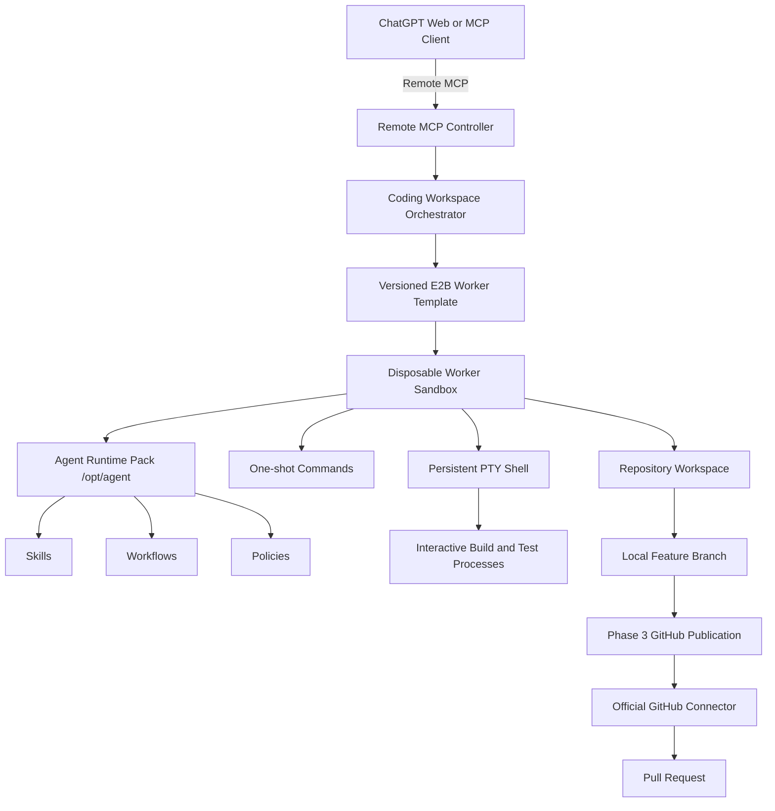

# Architecture Map: E2B Agent Runtime

An architecture and runtime for running a **Remote Model Context Protocol (MCP) Controller** in an isolated cloud computer using E2B Sandboxes, orchestrating disposable E2B Worker Sandboxes for safe tool execution, PTY terminal sessions, runtime packs, and GitHub branch publication.

---

## Phase 4 PTY-backed Coding Workspace Architecture

---

## Component Index

### 1. Remote MCP Controller & Workspace Orchestration (`src/controller/`, `src/mcp/`, `src/workspace/`)
- **Server**: Express HTTP + Streamable HTTP MCP server on port 3000.
- **Authentication**: Bearer token (`MCP_ACCESS_TOKEN`).
- **Coding Workspace Orchestrator**: `coding_workspace_start`, `coding_workspace_get`, `coding_workspace_destroy`, `workspace_list_ports`. Transactional workspace creation combining repo clone, base SHA verification, feature branch checkout, runtime bootstrap, and PTY startup.

### 2. Persistent PTY & Terminal Sessions (`src/terminal/`)
- **Terminal Session Manager**: `terminal_open`, `terminal_exec`, `terminal_write`, `terminal_read`, `terminal_resize`, `terminal_send_signal`, `terminal_close`, `terminal_list`.
- **PTY Buffer**: Monotonic global byte cursor ring buffer (`PTY_BUFFER_MAX_BYTES=1048576`), gap detection, UTF-8 chunking, and output truncation.
- **Signal Restriction**: Restricts allowed signals to `SIGINT`, `SIGTERM`, `SIGHUP`, `SIGWINCH`.

### 3. Repository Runtime Pack & Skills System (`runtime-pack/`, `src/runtime/`)
- **Runtime Pack**: System instructions handbook, version metadata (`MANIFEST.json`), skills index (`SKILLS_INDEX.md`), workflow definitions, markdown templates, security policies, and executable bootstrap (`agent-bootstrap`).
- **Skills Runtime Registry**: Loaded skills dispatcher, workflow schema validator (Zod), and session checkpoint store.

### 4. GitHub App Integration (`src/github/`)
- **Token Broker**: Generates short-lived, repository-scoped installation tokens.
- **Authorization Policy**: Enforces owner/repo validation and explicit allowlists.
- **Secret Gate & Preflight**: Scans committed diffs for secrets before branch publication.

---

## Trust & Security Boundaries

| Scope | Exposed Credentials | Allowed Operations |
|---|---|---|
| **Controller Sandbox** | `E2B_API_KEY`, `MCP_ACCESS_TOKEN`, `GITHUB_APP_PRIVATE_KEY` | Auth broker, token minting, policy authorization, worker lifecycle, workspace orchestration |
| **Worker Sandbox** | Short-lived installation token passed inline per command | Local checkout, PTY interactive sessions, one-shot commands, dev servers, test execution, branch publication |
| **MCP Client (ChatGPT)** | Bearer Token (`MCP_ACCESS_TOKEN`) | High-level Remote MCP tool calls. ChatGPT is the reasoning layer. |
