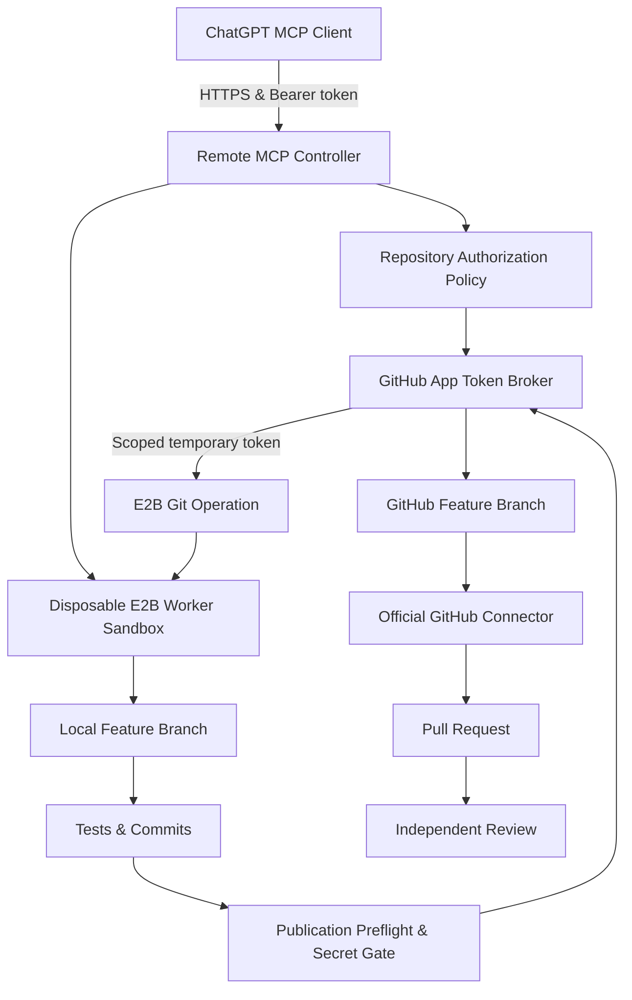

# E2B Agent Runtime

An architecture and runtime for running a **Remote Model Context Protocol (MCP) Controller** in an isolated cloud computer using [E2B Sandboxes](https://e2b.dev), orchestrating disposable E2B Worker Sandboxes for safe tool execution, repository workspace management, and GitHub branch publication.

---

## Phase 3 Architecture: GitHub Integration & Repository Workspace Management



### Trust Boundaries & Isolation Model

| Component | E2B Lifecycle | Terminal / Filesystem Exposure | Secrets Access |
|---|---|---|---|
| **Controller Sandbox** | `onTimeout: "pause"`, `autoResume: true` | **NEVER** exposed to clients. Runs HTTP server only. | Holds `E2B_API_KEY`, `MCP_ACCESS_TOKEN`, and `GITHUB_APP_PRIVATE_KEY`. |
| **Worker Sandboxes** | `onTimeout: "kill"`, `autoResume: false` | Restricted to `/workspace`. Executes tool & Git commands. | Receives short-lived, repository-scoped installation access tokens inline only. **ZERO** master keys or private keys passed. |

- **Controller Isolation**: External MCP clients can **never** execute commands inside the Controller Sandbox.
- **Worker Isolation**: Worker Sandboxes are completely disposable. Commands are restricted to `/workspace` (paths escaping `/workspace` are rejected). Outputs are truncated at 128 KB.
- **Secret Redaction**: All secrets (`E2B_API_KEY`, `MCP_ACCESS_TOKEN`, `GITHUB_APP_PRIVATE_KEY`, installation access tokens) are automatically redacted from logs, error messages, and diffs.

---

## Environment Configuration

Copy `.env.example` to `.env`:
```bash
cp .env.example .env
```

| Variable | Description | Default | Required |
|---|---|---|---|
| `E2B_API_KEY` | E2B Cloud API Key | - | **Yes** |
| `MCP_ACCESS_TOKEN` | Bearer token for MCP authentication | - | **Yes** |
| `CONTROLLER_PORT` | Controller HTTP server port | `3000` | No |
| `WORKER_DEFAULT_TIMEOUT_MS` | Default worker sandbox timeout | `600000` (10m) | No |
| `WORKER_MAX_TIMEOUT_MS` | Maximum worker sandbox timeout | `3600000` (1h) | No |
| `MAX_ACTIVE_WORKERS` | Maximum concurrent worker sandboxes | `3` | No |
| `COMMAND_DEFAULT_TIMEOUT_MS` | Default command execution timeout | `60000` (1m) | No |
| `COMMAND_MAX_TIMEOUT_MS` | Maximum command execution timeout | `300000` (5m) | No |
| `COMMAND_OUTPUT_LIMIT_BYTES` | Output truncation limit in bytes | `131072` (128KB) | No |
| `SESSION_REGISTRY_PATH` | Local JSON registry file path | `.data/sessions.json` | No |
| `GITHUB_APP_ID` | GitHub App ID | - | If GitHub publishing enabled |
| `GITHUB_APP_INSTALLATION_ID` | GitHub App Installation ID | - | If GitHub publishing enabled |
| `GITHUB_APP_PRIVATE_KEY` | GitHub App PEM Private Key | - | If GitHub publishing enabled |
| `GITHUB_APP_PRIVATE_KEY_BASE64` | Base64 encoded PEM Private Key | - | Alternative to raw key |
| `GITHUB_ALLOWED_REPOSITORIES` | Comma-separated `owner/repo` allowlist | - | No |
| `GITHUB_ALLOWED_OWNERS` | Comma-separated owner allowlist | - | No |
| `GITHUB_DEFAULT_BRANCH_PREFIX` | Branch prefix for feature branches | `agent/` | No |

---

## MCP Tools Reference

The Remote MCP Controller exposes 20 tools to authenticated MCP clients:

### Core Runtime Tools

| Tool | Input Schema | Description |
|---|---|---|
| `runtime_create_session` | `{ timeoutMs?, taskLabel?, metadata? }` | Spawns a disposable E2B Worker Sandbox (`/workspace`). Returns opaque `sessionId`. |
| `runtime_list_sessions` | `{}` | Lists all active and recent worker sessions and last command statuses. |
| `runtime_get_session` | `{ sessionId }` | Retrieves detailed state and lifecycle info for a session. |
| `runtime_run_command` | `{ sessionId, command, cwd?, timeoutMs? }` | Executes a shell command inside Worker `/workspace` with timeout and output limits. |
| `runtime_destroy_session` | `{ sessionId }` | Idempotently kills a Worker Sandbox. |
| `runtime_destroy_all_sessions` | `{ confirm: true }` | Emergency teardown of all active worker sandboxes. |

### Repository & Git Tools (Phase 3)

| Tool | Input Schema | Description |
|---|---|---|
| `repository_bind` | `{ sessionId, repository, baseBranch? }` | Bind session to an authorized GitHub repository (`owner/repo`). |
| `repository_clone` | `{ sessionId }` | Clone base branch into `/workspace/repository` using installation access token. |
| `repository_inspect` | `{ sessionId }` | Return structured repository summary (branches, HEAD, clean/dirty, manifests, governance files). |
| `repository_read_file` | `{ sessionId, path, startLine?, endLine? }` | Read safe file content inside `/workspace/repository`. Rejects `.git` and `.env`. |
| `repository_write_file` | `{ sessionId, path, content }` | Write file content inside `/workspace/repository` safely. |
| `repository_apply_patch` | `{ sessionId, patch }` | Apply unified diff patch inside `/workspace/repository`. |
| `git_create_branch` | `{ sessionId, branchName }` | Create local feature branch with `agent/` prefix from base SHA. |
| `git_status` | `{ sessionId }` | Return structured Git status (staged, unstaged, untracked, clean). |
| `git_diff` | `{ sessionId, mode?, pathFilters? }` | Return bounded unified diff (working, staged, base comparison). Secrets redacted. |
| `git_commit` | `{ sessionId, message, paths }` | Create local Git commit from explicitly staged paths using bot identity (`E2B Agent Runtime`). |
| `validation_record` | `{ sessionId, command, category, exitCode, durationMs, summary? }` | Record executed validation command for preflight correlation. |
| `github_preflight_publish` | `{ sessionId }` | Verify clean worktree, secret gate, base branch drift (`baseMoved`), and validation records. |
| `github_publish_branch` | `{ sessionId, confirmation }` | Publish feature branch to GitHub using short-lived installation access token. |
| `github_prepare_pr_handoff` | `{ sessionId }` | Generate structured PR handoff metadata for ChatGPT official GitHub connector. |

---

## Operational Command Reference

```bash
# Local Development & Validation
pnpm dev                   # Run Controller locally on port 3000
pnpm typecheck             # Run TypeScript type checking
pnpm lint                  # Run static analysis
pnpm test                  # Run Vitest unit test suite (39 tests)
pnpm build                 # Compile TypeScript source code to dist/
pnpm check                 # Full static suite (typecheck + test + build)

# GitHub App Operations & Diagnostics
pnpm github:verify-app                     # Verify GitHub App authentication
pnpm github:list-accessible-repositories  # List repositories accessible to App installation
pnpm github:verify-repository <owner/repo> # Check authorization and API details for a repo

# Integration Tests (Gated by environment variables)
pnpm test:integration:private-clone       # Test private repo cloning
pnpm test:integration:publish             # Test real feature branch push to disposable repo

# E2B Controller Sandbox Management
pnpm controller:provision  # Provision and deploy Controller to E2B Sandbox
pnpm controller:status     # Check status of deployed Controller Sandbox
pnpm controller:resume     # Resume paused Controller Sandbox
pnpm controller:destroy    # Destroy Controller Sandbox (requires --confirm)
pnpm controller:logs       # View sanitized Controller server logs
```

---

## GitHub App Setup Guide

1. Create a GitHub App in your organization or personal account settings.
2. Grant **Repository permissions**:
   - `Contents`: Read & write (Required for branch publication)
   - `Metadata`: Read-only (Required for repository inspection)
3. Generate a Private Key (.pem file) and store it securely (e.g. in `.env` or secret manager).
4. Install the GitHub App on your target repositories.
5. Set `GITHUB_APP_ID`, `GITHUB_APP_INSTALLATION_ID`, and `GITHUB_APP_PRIVATE_KEY` in Controller environment.

---

## Official GitHub Connector Handoff Workflow

After publishing a feature branch via `github_publish_branch`:
1. Call `github_prepare_pr_handoff` to obtain the structured handoff metadata.
2. Copy or pass the suggested PR title, body, branch name, and commit summary to ChatGPT.
3. Use ChatGPT's official GitHub connector to:
   - Verify the published branch on GitHub.
   - Open the Pull Request targeting the base branch.
   - Inspect CI build/test statuses on GitHub.