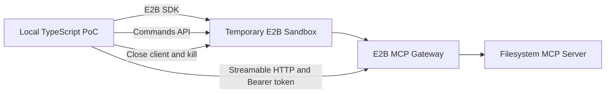

# E2B Agent Runtime - Phase 1 PoC

A secure, tested TypeScript proof of concept demonstrating external client interaction with an **E2B Sandbox** running the **E2B MCP Gateway** with a filesystem MCP server.

This is Phase 1 of a larger architecture enabling external applications (such as ChatGPT Web and MCP-compatible agents) to spawn and control temporary isolated E2B coding environments.

---

## Architecture & Data Flow



### Flow Lifecycle Overview
1. **Sandbox Spawn**: The local process uses the official `e2b` SDK to spin up a temporary Sandbox configured with the E2B MCP Gateway and `@modelcontextprotocol/server-filesystem` server restricted to `/workspace`.
2. **MCP Gateway Auth**: Retrieves the MCP Gateway external URL (`sandbox.getMcpUrl()`) and temporary access token (`sandbox.getMcpToken()`).
3. **MCP Client Connectivity**: Connects using `@modelcontextprotocol/sdk` (`StreamableHTTPClientTransport`) over Streamable HTTP with `Authorization: Bearer <token>`.
4. **Tool Discovery & Execution**: Discovers filesystem tools (`listTools()`), writes a marker file (`/workspace/poc-marker.txt`), reads back the content, and verifies content equality.
5. **Terminal Validation**: Executes environment checks (`pwd`, `whoami`, `git --version`, `node --version`, `python3 --version`, and `git init` test) via `sandbox.commands.run()`.
6. **Teardown & Cleanup**: Client connection is closed and Sandbox is destroyed in a `finally` block even if any preceding step throws an exception.

---

## Prerequisites & Requirements

- **Node.js**: `v20.0.0` or higher
- **Package Manager**: `pnpm` (`v9` or `v11`)
- **E2B API Key**: Required for real cloud sandbox execution ([Get an E2B API Key](https://e2b.dev/docs/api-key))

---

## Environment Setup

1. **Clone & Install Dependencies**:
   ```bash
   git clone https://github.com/imMamdouhaboammar/e2b-agent-runtime.git
   cd e2b-agent-runtime
   pnpm install
   ```

2. **Configure Environment Variables**:
   Copy `.env.example` to `.env`:
   ```bash
   cp .env.example .env
   ```
   Edit `.env` and set your `E2B_API_KEY`:
   ```env
   E2B_API_KEY=e2b_sec_xxxxxxxxxxxxxxxxxxxx
   E2B_SANDBOX_TIMEOUT_MS=600000
   ```

   > [!IMPORTANT]
   > Never commit `.env` or print `E2B_API_KEY` or MCP access tokens to console, logs, or reports. `.env` is ignored by `.gitignore`.

---

## Command Reference

| Command | Description |
|---|---|
| `pnpm dev` / `pnpm poc` | Run the live E2B Sandbox MCP Proof of Concept |
| `pnpm typecheck` | Run TypeScript type checking (`tsc --noEmit`) |
| `pnpm lint` | Run code static analysis |
| `pnpm test` | Run Vitest unit test suite |
| `pnpm build` | Compile TypeScript source code to `dist/` |
| `pnpm check` | Run full static validation suite (`typecheck` + `test` + `build`) |

---

## Expected Output

When running `pnpm poc` with a valid `E2B_API_KEY`, the script outputs a sanitized JSON summary:

```json
{
  "status": "passed",
  "sandboxCreated": true,
  "mcpConnected": true,
  "toolsDiscovered": 5,
  "filesystemWriteVerified": true,
  "filesystemReadVerified": true,
  "terminalChecksPassed": true,
  "sandboxDestroyed": true
}
```

If an error occurs or `E2B_API_KEY` is missing:

```json
{
  "status": "failed",
  "sandboxCreated": false,
  "mcpConnected": false,
  "toolsDiscovered": 0,
  "filesystemWriteVerified": false,
  "filesystemReadVerified": false,
  "terminalChecksPassed": false,
  "sandboxDestroyed": false,
  "error": "Configuration error: E2B_API_KEY environment variable is required."
}
```

---

## Cleanup Guarantees

Sandbox and client teardown are enforced using `try ... catch ... finally` blocks:
- **MCP Client**: Closed via `client.close()` in `finally`.
- **Sandbox Destruction**: Killed via `sandbox.kill()` in `finally`.
- **Error Protection**: Teardown errors are logged as warnings and never overwrite or mask primary application errors.
- **Process Status**: Exit code `1` is set whenever execution fails.

---

## Sandbox Inspection & E2B Dashboard

- **Dashboard**: View active and recent sandboxes at [https://e2b.dev/dashboard](https://e2b.dev/dashboard).
- **CLI Connection**: Inspect a running sandbox interactively using the E2B CLI:
  ```bash
  npx @e2b/cli connect <sandbox-id>
  ```
- **Gateway Logs**: Inside the sandbox, inspect gateway operations:
  ```bash
  cat /var/log/mcp-gateway/gateway.log
  ```

---

## Optional MCP Inspector Debugging

You can connect to a running E2B Sandbox MCP Gateway using the official MCP Inspector:

```bash
npx @modelcontextprotocol/inspector <mcp-url>
```

> [!CAUTION]
> When prompted for HTTP authorization, pass `Bearer <mcp-token>`. **Never paste, log, or commit your MCP token or API key into public repositories or chat windows.**

---

## Security Boundaries & Current Limitations

### Security Controls
- Filesystem access is strictly scoped to `/workspace`. Root (`/`) and system paths are not exposed.
- All secrets (`E2B_API_KEY`, MCP Bearer tokens) are programmatically redacted from outputs.
- TLS and token-based Bearer authentication protect the external HTTP Gateway transport.

### Phase 1 Limitations
- **Ephemeral Storage**: Sandboxes are killed immediately after PoC execution completes.
- **No Controller Sandbox**: Host process runs locally rather than inside a control sandbox.
- **Single-User Scope**: Designed for single PoC runner execution.

---

## Explicit Phase 2 Scope

The following items are intentionally deferred to Phase 2:
- ChatGPT Developer Mode & Action integration
- Controller Sandbox & persistent public gateway
- GitHub App authentication & repository cloning
- PR creation and branch publishing from inside E2B
- Database persistence, Redis, and background task queues
- Custom E2B templates, pause/resume, and multi-user auth
- Deployment pipelines (Cloud Run, Hostinger, Vercel)