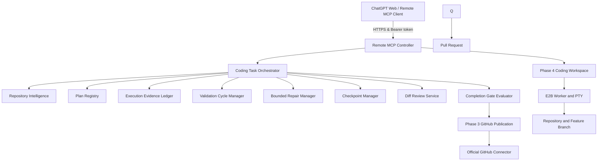

# E2B Agent Runtime

An architecture and runtime for running a **Remote Model Context Protocol (MCP) Controller** in an isolated cloud computer using [E2B Sandboxes](https://e2b.dev), orchestrating disposable E2B Worker Sandboxes for safe tool execution, persistent PTY terminal sessions, repository intelligence, task planning, evidence tracking, bounded repair cycles, checkpoints, diff review, and GitHub branch publication.

---

## Phase 5 Architecture: Structured AI-Assisted Coding Workflow Engine



### Trust Boundaries & Isolation Model

| Component | E2B Lifecycle | Terminal / Filesystem Exposure | Secrets Access |
|---|---|---|---|
| **Controller Sandbox** | `onTimeout: "pause"`, `autoResume: true` | **NEVER** exposed to clients. Runs HTTP server & workflow state. | Holds `E2B_API_KEY`, `MCP_ACCESS_TOKEN`, and `GITHUB_APP_PRIVATE_KEY`. |
| **Worker Sandboxes** | `onTimeout: "kill"`, `autoResume: false` | Restricted to `/workspace`. Executes tool, PTY, & Git commands. | Receives short-lived, repository-scoped installation access tokens inline only. **ZERO** master keys or private keys passed. |
| **MCP Client (ChatGPT)** | Remote MCP Client | Controls workspace via MCP tools. | High-level Remote MCP tool calls. ChatGPT is the reasoning layer. No inner AI coding model is installed. |

- **ChatGPT is the Reasoning Layer**: ChatGPT Web or another Remote MCP client acts as the reasoning coding agent, directly controlling the terminal and workflow via MCP. No nested inner AI CLI (such as OpenCode or Codex CLI) is installed or run by default.
- **Worker Isolation**: Worker Sandboxes are completely disposable. Persistent PTY sessions and command execution are restricted to `/workspace/repository`.
- **Secret Redaction**: All secrets (`E2B_API_KEY`, `MCP_ACCESS_TOKEN`, `GITHUB_APP_PRIVATE_KEY`, installation access tokens) are automatically redacted from logs, error messages, diffs, and checkpoints.

---

## Environment Configuration

Copy `.env.example` to `.env`:
```bash
cp .env.example .env
```

| Variable | Description | Default | Required |
|---|---|---|---|
| `E2B_API_KEY` | E2B Cloud API Key | - | **Yes** |
| `MCP_ACCESS_TOKEN` | Bearer token for MCP authentication | - | **Yes** |
| `CONTROLLER_PORT` | Controller HTTP server port | `3000` | No |
| `E2B_WORKER_TEMPLATE` | Private versioned E2B Worker Template tag | `agent-coding-runtime-core:stable` | No |
| `MAX_ACTIVE_WORKERS` | Maximum concurrent worker sandboxes | `3` | No |
| `MAX_TERMINALS_PER_WORKSPACE` | Maximum active terminals per workspace | `3` | No |
| `MAX_PLAN_STEPS` | Maximum steps per task plan | `20` | No |
| `MAX_REPAIR_CYCLES` | Maximum test/repair cycles per task | `3` | No |
| `MAX_TOTAL_COMMANDS_PER_TASK` | Execution command limit per task | `100` | No |
| `WORKER_DEFAULT_TIMEOUT_MS` | Default worker sandbox timeout | `600000` (10m) | No |
| `GITHUB_APP_ID` | GitHub App ID | - | If GitHub publishing enabled |
| `GITHUB_APP_INSTALLATION_ID` | GitHub App Installation ID | - | If GitHub publishing enabled |
| `GITHUB_APP_PRIVATE_KEY` | GitHub App PEM Private Key | - | If GitHub publishing enabled |

---

## Phase 5 MCP Tools Reference (60 Total Remote MCP Tools)

### Phase 5 Coding Workflow Engine Tools

| Tool | Category | Input Schema | Description |
|---|---|---|---|
| `coding_task_start` | State-changing | `{ workspaceId, repository, taskMode, taskLabel, userRequest }` | Starts a coding task and selects task workflow. |
| `coding_task_get` | Read-only | `{ taskId }` | Retrieves detailed state and summary of a coding task. |
| `repository_intelligence_scan` | Read-only | `{ taskId, depth?, includeGenerated?, includeWorkflows? }` | Intelligently scans workspace repository structure, manifests, and commands. |
| `repository_intelligence_get` | Read-only | `{ taskId, section? }` | Gets a specific section of the repository intelligence report. |
| `repository_search` | Read-only | `{ taskId, query, paths?, fileGlobs?, maxResults? }` | Searches file content using safe ripgrep within the bound repository. |
| `repository_find_files` | Read-only | `{ taskId, namePattern?, pathPattern?, extensions? }` | Finds files matching patterns within the repository. |
| `repository_symbol_search` | Read-only | `{ taskId, symbol, language?, paths? }` | Searches for code symbols with confidence rating (`high`, `medium`, `low`). |
| `coding_plan_set` | State-changing | `{ taskId, confirmedProblem, intendedChange, untouchedScope, verificationMethod, steps }` | Sets structured plan with dependency cycle validation and verification requirements. |
| `coding_plan_update_step` | State-changing | `{ taskId, stepId, status, evidenceRefs?, blocker?, note? }` | Updates plan step status. Prevents marking validation steps complete without evidence. |
| `coding_plan_get` | Read-only | `{ taskId }` | Gets current plan for a coding task. |
| `execution_record_command` | State-changing | `{ taskId, executionId, category, purpose?, relatedStepId? }` | Associates actual terminal execution with task as official evidence. |
| `execution_list_evidence` | Read-only | `{ taskId, category?, status?, limit? }` | Lists recorded execution evidence for a task. |
| `validation_plan_detect` | Read-only | `{ taskId, targetPaths?, taskMode? }` | Proposes validation commands based on repository intelligence. |
| `validation_cycle_start` | State-changing | `{ taskId, plannedCategories, cycleLabel? }` | Starts a validation cycle. Enforces repair budget. |
| `validation_cycle_complete` | State-changing | `{ taskId, cycleId, evidenceIds, summary? }` | Completes validation cycle using real execution evidence. |
| `validation_get_status` | Read-only | `{ taskId }` | Gets current validation status and remaining repair budget. |
| `failure_classify` | Read-only | `{ taskId, executionId, clientInterpretation? }` | Classifies failure category and repeated failure signatures. |
| `repair_attempt_start` | State-changing | `{ taskId, cycleId, failureEvidenceIds, hypothesis }` | Starts a bounded repair attempt following a failed cycle. |
| `repair_attempt_complete` | State-changing | `{ taskId, repairAttemptId, inspectedPaths, changedPaths, result }` | Completes repair attempt and tracks modified paths. |
| `coding_checkpoint_create` | State-changing | `{ taskId, reason, decisions, inspectedPaths, importantSymbols, blockers, risks, exactNextAction }` | Creates compact, sanitized task checkpoint (`SESSION_CHECKPOINT.md`). |
| `coding_checkpoint_get` | Read-only | `{ taskId, checkpointId }` | Gets details of a task checkpoint. |
| `coding_checkpoint_list` | Read-only | `{ taskId }` | Lists checkpoint metadata for a task. |
| `coding_task_resume` | State-changing | `{ taskId, checkpointId }` | Resumes task from checkpoint with drift detection. |
| `coding_diff_review` | Read-only | `{ taskId, includePatch?, maxPatchBytes? }` | Reviews working tree diff against base SHA, secret findings, and scope expansion. |
| `coding_completion_gate` | Read-only | `{ taskId, acknowledgeUnavailableChecks? }` | Evaluates completion gates before publication preflight. |
| `coding_pr_handoff_prepare` | Read-only | `{ taskId }` | Prepares structured Pull Request handoff markdown using `PR_TEMPLATE.md`. |
| `coding_task_abandon` | State-changing | `{ taskId, confirm: true, reason }` | Abandons coding task with explicit confirmation. |

---

## Development & Testing Commands

```bash
# Full static verification, unit tests, and build
pnpm check

# Run unit tests only
pnpm test

# Workflow policy & list scripts
pnpm workflow:validate
pnpm workflow:list
pnpm runtime:inspect-task-policy

# Gated Integration Tests
pnpm test:integration:workflow
pnpm test:integration:repair-cycle
pnpm test:integration:checkpoint-resume
pnpm test:integration:completion-gate
```