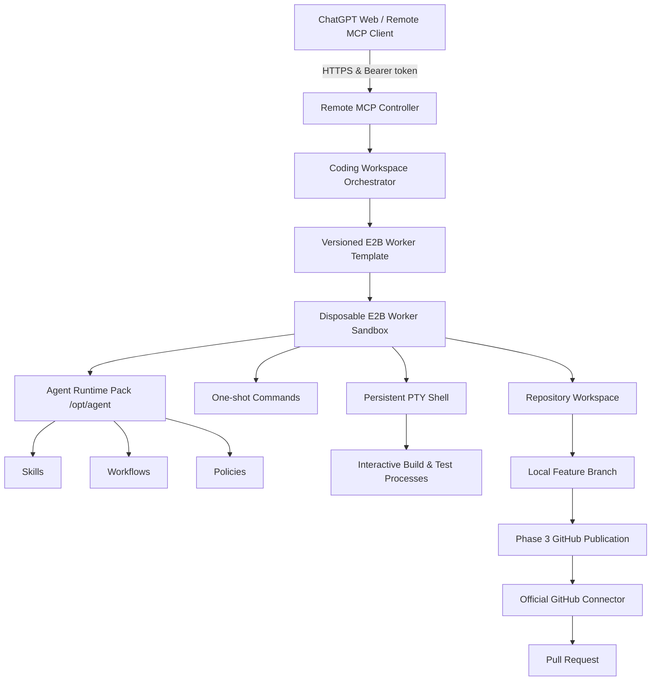

# E2B Agent Runtime

An architecture and runtime for running a **Remote Model Context Protocol (MCP) Controller** in an isolated cloud computer using [E2B Sandboxes](https://e2b.dev), orchestrating disposable E2B Worker Sandboxes for safe tool execution, persistent PTY terminal sessions, runtime packs, structured workflows, and GitHub branch publication.

---

## Phase 4 Architecture: PTY-backed Coding Workspace Layer



### Trust Boundaries & Isolation Model

| Component | E2B Lifecycle | Terminal / Filesystem Exposure | Secrets Access |
|---|---|---|---|
| **Controller Sandbox** | `onTimeout: "pause"`, `autoResume: true` | **NEVER** exposed to clients. Runs HTTP server only. | Holds `E2B_API_KEY`, `MCP_ACCESS_TOKEN`, and `GITHUB_APP_PRIVATE_KEY`. |
| **Worker Sandboxes** | `onTimeout: "kill"`, `autoResume: false` | Restricted to `/workspace`. Executes tool, PTY, & Git commands. | Receives short-lived, repository-scoped installation access tokens inline only. **ZERO** master keys or private keys passed. |

- **ChatGPT is the Reasoning Layer**: ChatGPT Web or another Remote MCP client acts as the reasoning coding agent, directly controlling the terminal via MCP. No nested inner AI CLI (such as OpenCode or Codex CLI) is installed or run by default.
- **Worker Isolation**: Worker Sandboxes are completely disposable. Persistent PTY sessions and command execution are restricted to `/workspace/repository`.
- **Secret Redaction**: All secrets (`E2B_API_KEY`, `MCP_ACCESS_TOKEN`, `GITHUB_APP_PRIVATE_KEY`, installation access tokens) are automatically redacted from logs, error messages, and diffs.

---

## Environment Configuration

Copy `.env.example` to `.env`:
```bash
cp .env.example .env
```

| Variable | Description | Default | Required |
|---|---|---|---|
| `E2B_API_KEY` | E2B Cloud API Key | - | **Yes** |
| `MCP_ACCESS_TOKEN` | Bearer token for MCP authentication | - | **Yes** |
| `CONTROLLER_PORT` | Controller HTTP server port | `3000` | No |
| `E2B_WORKER_TEMPLATE` | Private versioned E2B Worker Template tag | `agent-coding-runtime-core:stable` | No |
| `MAX_ACTIVE_WORKERS` | Maximum concurrent worker sandboxes | `3` | No |
| `MAX_TERMINALS_PER_WORKSPACE` | Maximum active terminals per workspace | `3` | No |
| `PTY_BUFFER_MAX_BYTES` | PTY ring buffer capacity limit | `1048576` (1MB) | No |
| `PTY_READ_DEFAULT_BYTES` | Default PTY read size | `65536` (64KB) | No |
| `PTY_READ_MAX_BYTES` | Maximum PTY read chunk size | `262144` (256KB) | No |
| `WORKER_DEFAULT_TIMEOUT_MS` | Default worker sandbox timeout | `600000` (10m) | No |
| `WORKER_MAX_TIMEOUT_MS` | Maximum worker sandbox timeout | `3600000` (1h) | No |
| `GITHUB_APP_ID` | GitHub App ID | - | If GitHub publishing enabled |
| `GITHUB_APP_INSTALLATION_ID` | GitHub App Installation ID | - | If GitHub publishing enabled |
| `GITHUB_APP_PRIVATE_KEY` | GitHub App PEM Private Key | - | If GitHub publishing enabled |

---

## Remote MCP Tools Reference

The Remote MCP Controller exposes 34 tools to authenticated MCP clients across Phase 1, Phase 2, Phase 3, and Phase 4:

### Phase 4 Coding Workspace & Terminal Tools

| Tool | Input Schema | Description |
|---|---|---|
| `agent_runtime_info` | `{}` | Returns runtime version, skills pack version, workflow schema version, and security mode. |
| `agent_list_skills` | `{}` | Lists all runtime skills with descriptions and content hashes. |
| `agent_load_skill` | `{ skillName, maxBytes? }` | Loads full or bounded content of a runtime skill. Rejects path traversal. |
| `agent_get_workflow` | `{ workflowName }` | Returns structured workflow definition validated against Zod schema. |
| `agent_get_operating_instructions` | `{}` | Returns operating handbook instructions for the Worker Sandbox session. |
| `coding_workspace_start` | `{ repository, taskMode?, baseBranch?, branchName?, templateTag?, initialTerminal? }` | Transactionally starts a coding workspace with clone, feature branch, bootstrap, and PTY. |
| `coding_workspace_get` | `{ workspaceId }` | Returns detailed workspace state and active terminals. |
| `terminal_open` | `{ workspaceId, shell?, cwd?, cols?, rows? }` | Opens a persistent interactive PTY shell inside `/workspace/repository`. |
| `terminal_exec` | `{ workspaceId, command, cwd?, timeoutMs? }` | Executes a deterministic one-shot command inside the Worker Sandbox. |
| `terminal_write` | `{ workspaceId, terminalId, input }` | Sends input string or control sequences to an active PTY. |
| `terminal_read` | `{ workspaceId, terminalId, cursor?, maxBytes? }` | Reads incremental output from PTY using monotonic byte cursors. |
| `terminal_resize` | `{ workspaceId, terminalId, cols, rows }` | Resizes active PTY window dimensions. |
| `terminal_send_signal` | `{ workspaceId, terminalId, signal }` | Sends safe signal (`SIGINT`, `SIGTERM`, `SIGHUP`, `SIGWINCH`) to PTY process. |
| `terminal_close` | `{ workspaceId, terminalId }` | Closes active PTY session cleanly. |
| `terminal_list` | `{ workspaceId }` | Lists all active terminals for a workspace. |
| `workspace_list_ports` | `{ workspaceId }` | Detects open listening ports and preview URLs inside the Worker Sandbox. |
| `agent_create_checkpoint` | `{ workspaceId, repository?, branch?, nextAction? }` | Saves structured session checkpoint metadata. |
| `coding_workspace_destroy` | `{ workspaceId, confirm: true }` | Destroys coding workspace and associated Worker Sandbox. |

---

## Development & Testing Commands

```bash
# Full static verification, unit tests, and build
pnpm check

# Run unit tests only
pnpm test

# Template CLI Management
pnpm template:audit-base
pnpm template:build
pnpm template:verify
pnpm template:promote --confirm
pnpm template:info

# Gated Integration Tests
pnpm test:integration:workspace
pnpm test:integration:pty
pnpm test:integration:template
pnpm test:integration:ports
```