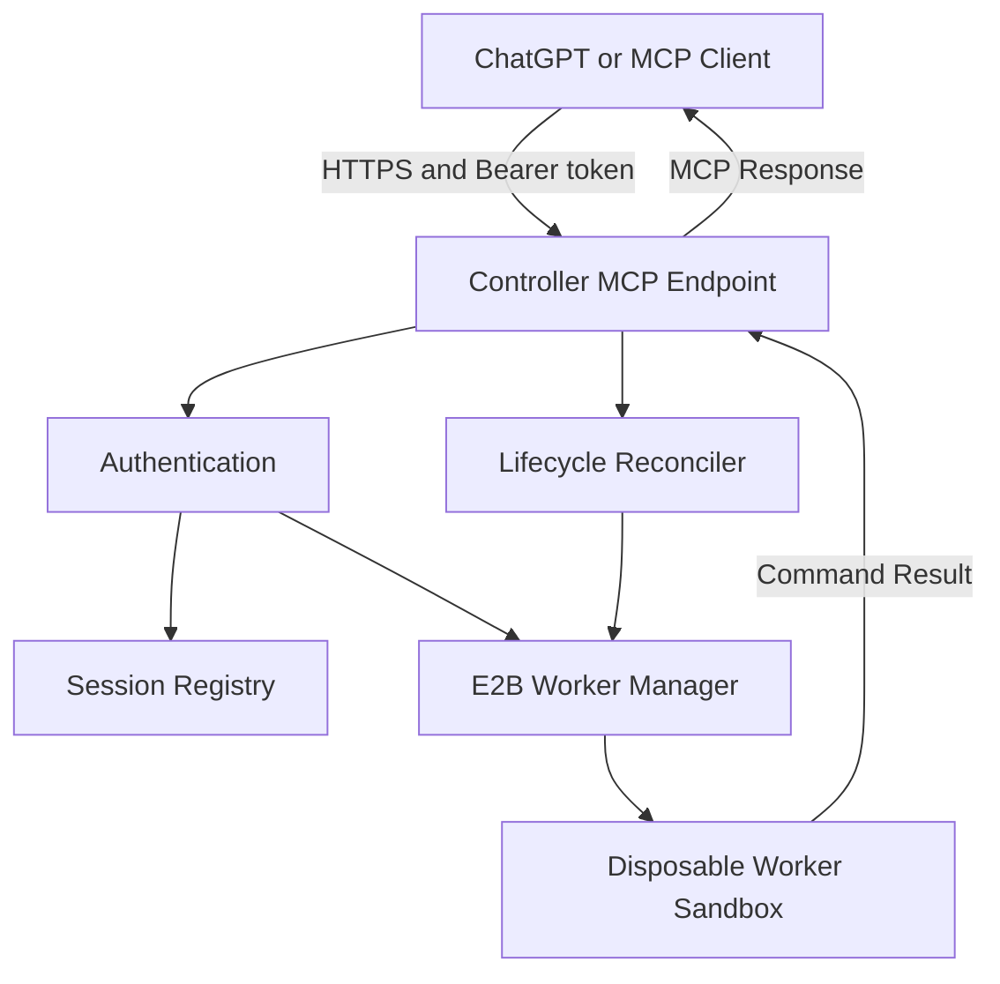

# E2B Agent Runtime

An architecture and runtime for running a **Remote Model Context Protocol (MCP) Controller** in an isolated cloud computer using [E2B Sandboxes](https://e2b.dev), orchestrating disposable E2B Worker Sandboxes for safe tool execution.

---

## Phase 2 Architecture: Remote MCP Controller & Worker Sandbox Management



### Trust Boundaries & Isolation Model

| Component | E2B Lifecycle | Terminal / Filesystem Exposure | Secrets Access |
|---|---|---|---|
| **Controller Sandbox** | `onTimeout: "pause"`, `autoResume: true` | **NEVER** exposed to clients. Runs HTTP server only. | Holds `E2B_API_KEY` and `MCP_ACCESS_TOKEN`. |
| **Worker Sandboxes** | `onTimeout: "kill"`, `autoResume: false` | Restricted to `/workspace`. Executes tool commands. | **ZERO** Controller secrets or API keys passed. |

- **Controller Isolation**: External MCP clients can **never** execute commands inside the Controller Sandbox.
- **Worker Isolation**: Worker Sandboxes are completely disposable. Commands are restricted to `/workspace` (paths escaping `/workspace` are rejected). Outputs are truncated at 128 KB.
- **Secret Redaction**: All secrets (`E2B_API_KEY`, `MCP_ACCESS_TOKEN`, Bearer headers) are automatically redacted from logs and error messages.

---

## Environment Configuration

Copy `.env.example` to `.env`:
```bash
cp .env.example .env
```

| Variable | Description | Default | Required |
|---|---|---|---|
| `E2B_API_KEY` | E2B Cloud API Key | - | **Yes** |
| `MCP_ACCESS_TOKEN` | Bearer token for MCP authentication | - | **Yes** |
| `CONTROLLER_PORT` | Controller HTTP server port | `3000` | No |
| `WORKER_DEFAULT_TIMEOUT_MS` | Default worker sandbox timeout | `600000` (10m) | No |
| `WORKER_MAX_TIMEOUT_MS` | Maximum worker sandbox timeout | `3600000` (1h) | No |
| `MAX_ACTIVE_WORKERS` | Maximum concurrent worker sandboxes | `3` | No |
| `COMMAND_DEFAULT_TIMEOUT_MS` | Default command execution timeout | `60000` (1m) | No |
| `COMMAND_MAX_TIMEOUT_MS` | Maximum command execution timeout | `300000` (5m) | No |
| `COMMAND_OUTPUT_LIMIT_BYTES` | Output truncation limit in bytes | `131072` (128KB) | No |
| `SESSION_REGISTRY_PATH` | Local JSON registry file path | `.data/sessions.json` | No |

---

## MCP Tools Reference

The Remote MCP Controller exposes 6 tools to authenticated MCP clients:

| Tool | Input Schema | Description |
|---|---|---|
| `runtime_create_session` | `{ timeoutMs?, taskLabel?, metadata? }` | Spawns a disposable E2B Worker Sandbox (`/workspace`). Returns opaque `sessionId`. |
| `runtime_list_sessions` | `{}` | Lists all active and recent worker sessions and last command statuses. |
| `runtime_get_session` | `{ sessionId }` | Retrieves detailed state and lifecycle info for a session. |
| `runtime_run_command` | `{ sessionId, command, cwd?, timeoutMs? }` | Executes a shell command inside Worker `/workspace` with timeout and output limits. |
| `runtime_destroy_session` | `{ sessionId }` | Idempotently kills a Worker Sandbox. |
| `runtime_destroy_all_sessions` | `{ confirm: true }` | Emergency teardown of all active worker sandboxes. |

---

## Operational Command Reference

```bash
# Local Development & Validation
pnpm dev                   # Run Controller locally on port 3000
pnpm typecheck             # Run TypeScript type checking
pnpm lint                  # Run static analysis
pnpm test                  # Run Vitest unit test suite (35 tests)
pnpm build                 # Compile TypeScript source code to dist/
pnpm check                 # Full static suite (typecheck + test + build)

# E2B Controller Sandbox Management
pnpm controller:provision  # Provision and deploy Controller to E2B Sandbox
pnpm controller:status     # Check status of deployed Controller Sandbox
pnpm controller:resume     # Resume paused Controller Sandbox
pnpm controller:destroy    # Destroy Controller Sandbox (requires --confirm)
pnpm controller:logs       # View sanitized Controller server logs
```

---

## ChatGPT & MCP Inspector Connection Guide

### Connecting MCP Inspector

Run the official MCP Inspector against the provisioned Controller:

```bash
npx @modelcontextprotocol/inspector <mcp-endpoint-url>
```

When prompted for authorization, pass:
```http
Authorization: Bearer <MCP_ACCESS_TOKEN>
```

> [!CAUTION]
> Never share or commit your `MCP_ACCESS_TOKEN`. Keep it safe in `.env`.

### Connecting ChatGPT Developer Mode

1. Deploy the Controller using `pnpm controller:provision`.
2. Copy the public HTTPS MCP URL output by the provisioner (e.g. `https://<sandbox-host>-3000.e2b.dev/mcp`).
3. In ChatGPT Developer Mode / Custom Actions setup:
   - **Endpoint URL**: `https://<sandbox-host>-3000.e2b.dev/mcp`
   - **Authentication**: Bearer Token
   - **Token**: Your `MCP_ACCESS_TOKEN`
4. Test by instructing ChatGPT: *"Create a runtime session and check Node.js version."*

---

## Controller vs Worker Lifecycle

- **Controller Pause & Auto-Resume**: The Controller Sandbox uses `onTimeout: "pause"` and `autoResume: true`. If inactive, E2B pauses the Controller to save compute credits. Incoming HTTP requests automatically trigger E2B auto-resume.
- **Worker Termination**: Worker Sandboxes use `onTimeout: "kill"`. Once expired or explicitly destroyed via `runtime_destroy_session`, all worker state is permanently cleaned up.

---

## Phase 3 Roadmap (Explicit Out-of-Scope for Phase 2)

- GitHub App authentication & repository cloning
- Branch publishing & Pull Request creation from inside Worker Sandboxes
- Multi-user authentication & OAuth providers
- Database persistence (PostgreSQL/Redis) & Background task queues